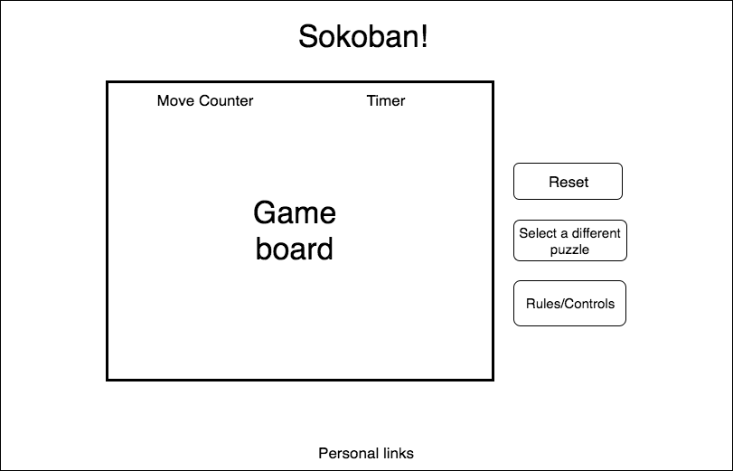
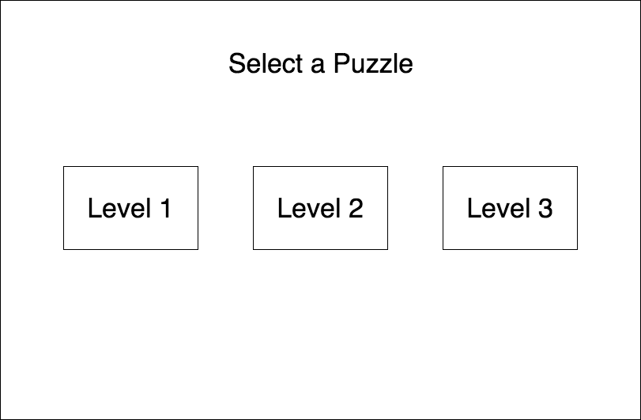
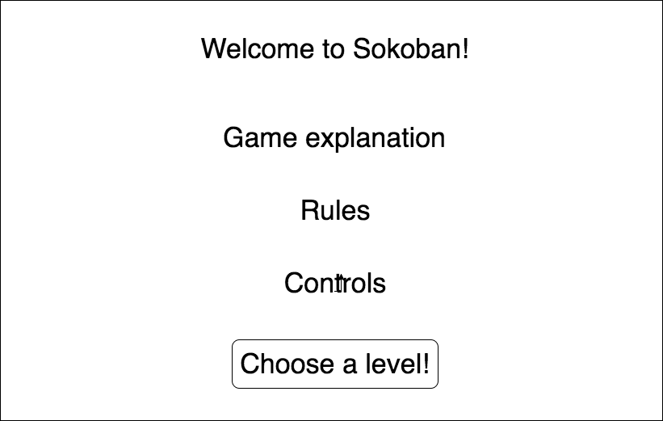

# Sokoban!
Sokoban is a classic Japanese puzzle game. The rules are simple: the player pushes boxes around a maze-like game board with the goal of placing all of the boxes on designated storage spaces. The player can only push boxes forward and may not push more than one box at a time.

## MVP Features
* Users can push boxes around the game board using the arrow keys until there are no more possible moves or the game is won.
* Users can select a puzzle from several options of varying difficulty.
* The current game board can be reset to its original state by clicking a button.
* A move counter and timer that keeps track of the player's progress
* A landing modal explaining the rules and controls

## Wireframes
Main Game Page

Level Select Modal

Landing Modal

## Implementation
This project will use JavaScript (ES6) for game logic; HTML, CSS, and Canvas to render the game board; and Webpack to bundle files.

### Timeline
**Phase 1**
* Setup project skeleton, configure webpack
* Implement canvas drawing using tiled background to render board
* Add character and controls to move around the game board

**Phase 2**
* Implement game logic to determine winning and losing scenarios
* Add reset button to start puzzle over
* Set up game board options of various difficulties

**Phase 3**
* Add move counter and timer
* Clean up styling, implement landing modal

## Bonus features
* Top scores keeping track of best move counts and times
* History to track and redo/undo moves
